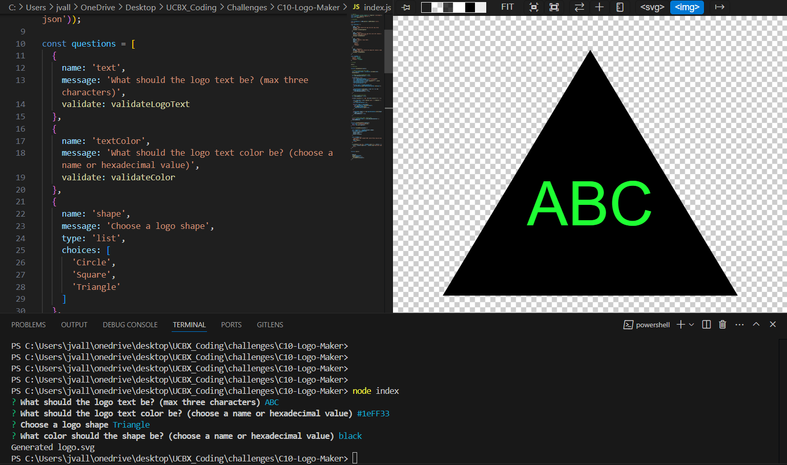

# C10-Logo-Maker
This project uses nodejs to build an svg logo via user input from the command line.

## Tutorial
To use this application, first ensure that nodejs is installed on your computer. Then complete the following steps:
1. Clone this repository to your local computer
2. In your computer's terminal, navigate to the root file of this project (C10-Logo-Maker)
3. Run the terminal command `node index`
4. Answer the prompted questions in the terminal
5. Once all questions have been answered, an svg file titled `logo.svg` will be generated and ready for use.

## Video & Screenshot

https://github.com/user-attachments/assets/0d4de28e-6ed7-457c-b73a-74dab75c5a65

## Code References

Split string via regex
* Purpose: Use regex to split a string into separate equal value chunks
* Source: https://stackoverflow.com/a/6259543/8032508
* Place(s) Used: `index.html`, variable `hexadecimalPairs`

Regex Character Limit
* Purpose: Validate that given text uses only expected characters and that the number of characters matches expectation.
* Source: https://stackoverflow.com/a/15288645/8032508
* Place(s) Used: `index.html`, variable `regexHexadecimalPair`

Valid SVG Color Names
* Purpose: Create a limited list of color names valid for svg files to validate input on color prompts
* Source: https://johndecember.com/html/spec/colorsvg.html
* Place(s) Used: Provides data for `colors.json`, referenced in `index.html` variable `validColors`

Text alignment support code
* Purpose: Assure that text in SVG is centered vertically and horizontally in image
* Source: https://stackoverflow.com/questions/5546346/how-to-place-and-center-text-in-an-svg-rectangle
* Place(s) Used: `shapes.js` file, class `Polygon.renderText()`
